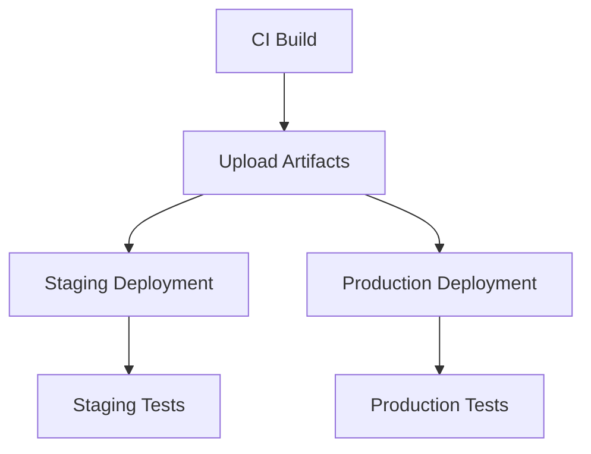

# GitHub Workflows

This directory contains GitHub Actions workflows for CI/CD, automation, and maintenance tasks.

## Workflows Overview

### 🔄 CI/CD Workflows

#### `ci.yml` - Continuous Integration
**Triggers**: Push/PR to `main` and `develop` branches

**Features**:
- **Smart Change Detection**: Only runs jobs for modified components
- **Parallel Execution**: Runs lint, type-check, test, and build in parallel
- **Multi-App Support**: Handles all applications (ccp-admin, ccp-client, ccp-docs)
- **Security Scanning**: Runs npm audit and Snyk security checks
- **Performance Testing**: Lighthouse CI for performance monitoring
- **Infrastructure Validation**: CDK synth and diff for infrastructure changes

**Jobs**:
1. `changes` - Detects what parts of the codebase changed
2. `setup` - Installs dependencies and caches them
3. `lint` - ESLint and Prettier formatting checks
4. `type-check` - TypeScript compilation and type checking
5. `test` - Unit tests with coverage reporting
6. `build` - Build applications and upload artifacts
7. `security` - Security audits and vulnerability scanning
8. `infrastructure-validate` - Validate CDK infrastructure
9. `e2e` - End-to-end tests (main branch only)
10. `performance` - Lighthouse performance tests
11. `release` - Create releases (main branch only)
12. `notify` - Slack notifications

#### `deploy-staging.yml` - Staging Deployment
**Triggers**: Push to `develop` branch, manual dispatch

**Features**:
- **Environment-Specific Builds**: Staging configuration and environment variables
- **AWS Infrastructure**: Deploys CDK stacks and Lambda functions
- **Static Site Hosting**: S3 + CloudFront for React applications
- **Health Checks**: Comprehensive smoke tests after deployment
- **Security Scanning**: OWASP ZAP security scan
- **Rollback Support**: Maintains backups for quick rollback

**Deployment Flow**:
1. Build applications with staging configuration
2. Deploy AWS infrastructure (API Gateway, Lambda, DynamoDB)
3. Deploy admin dashboard to S3
4. Deploy client application to S3
5. Run smoke tests and security scans
6. Notify team of deployment status

#### `deploy-production.yml` - Production Deployment
**Triggers**: Push to `main` branch, tagged releases, manual dispatch

**Features**:
- **Release Validation**: Only deploys tagged releases in production
- **Blue-Green Deployment**: Zero-downtime deployments
- **Enhanced Security**: Additional security checks and approvals
- **CloudFront CDN**: Global content delivery network
- **Comprehensive Testing**: Full E2E and integration test suite
- **Release Management**: Automatic GitHub release creation

**Deployment Flow**:
1. Pre-deployment validation and approval
2. Build applications with production optimization
3. Deploy infrastructure with production settings
4. Deploy applications to S3 with CloudFront
5. Run comprehensive health checks
6. Create GitHub release
7. Notify stakeholders

### 🧹 Maintenance Workflows

#### `cleanup.yml` - Resource Cleanup
**Triggers**: Weekly schedule (Sundays), manual dispatch

**Features**:
- **Artifact Management**: Removes old GitHub Actions artifacts
- **Cache Optimization**: Cleans up expired cache entries
- **AWS Resource Cleanup**: Removes old staging resources
- **Cost Optimization**: Helps reduce storage and compute costs
- **Dry Run Support**: Preview changes before execution

**Cleanup Tasks**:
- GitHub artifacts older than 30 days
- Actions cache entries older than 7 days
- Old S3 objects in staging buckets
- Unused Lambda function versions
- Old CloudWatch log streams

### 🔒 Security & Dependencies

#### `dependabot.yml` - Dependency Management
**Schedule**: Weekly updates on different days

**Features**:
- **Staggered Updates**: Different schedules for different components
- **Smart Ignoring**: Ignores major version updates for critical dependencies
- **Team Assignment**: Assigns updates to appropriate teams
- **Label Management**: Automatic labeling for better organization

**Update Schedule**:
- **Monday**: Root and app dependencies
- **Tuesday**: Library dependencies
- **Wednesday**: Infrastructure dependencies
- **Thursday**: GitHub Actions dependencies

#### `CODEOWNERS` - Code Review Requirements
**Features**:
- **Team-Based Reviews**: Assigns reviews based on file patterns
- **Hierarchical Ownership**: Multiple levels of code ownership
- **Security Oversight**: Special requirements for security-sensitive files
- **Expertise Matching**: Routes reviews to domain experts

## Environment Configuration

### Required Secrets

#### AWS Credentials
```bash
AWS_ACCESS_KEY_ID          # AWS access key for deployments
AWS_SECRET_ACCESS_KEY      # AWS secret key for deployments
AWS_ACCOUNT_ID            # AWS account ID for resource naming
```

#### Environment URLs
```bash
STAGING_API_BASE_URL      # Staging API endpoint
STAGING_WS_ENDPOINT       # Staging WebSocket endpoint
PRODUCTION_API_BASE_URL   # Production API endpoint
PRODUCTION_WS_ENDPOINT    # Production WebSocket endpoint
```

#### External Services
```bash
SNYK_TOKEN               # Snyk security scanning token
SLACK_WEBHOOK_URL        # Slack notifications webhook
CODECOV_TOKEN           # Codecov coverage reporting token
```

### Environment Protection

#### Staging Environment
- **Reviewers**: Not required
- **Deployment Branches**: `develop`
- **Environment Secrets**: Staging-specific configurations

#### Production Environment
- **Reviewers**: Required (infrastructure-team, security-team)
- **Wait Timer**: 5 minutes
- **Deployment Branches**: `main`, tags matching `v*`
- **Environment Secrets**: Production-specific configurations

## Workflow Dependencies

### Artifact Flow


### Cache Strategy
- **Node.js Dependencies**: Cached by `pnpm-lock.yaml` hash
- **Build Outputs**: Cached for reuse between jobs
- **CDK Assets**: Cached to speed up infrastructure deployments

## Monitoring & Notifications

### Slack Integration
- **Success Notifications**: Posted to `#ccp-deployments`
- **Failure Alerts**: Posted to `#ccp-alerts`
- **Maintenance Updates**: Posted to `#ccp-maintenance`

### Performance Monitoring
- **Lighthouse CI**: Tracks performance metrics over time
- **Bundle Analysis**: Monitors application bundle sizes
- **Load Testing**: Performance testing in staging environment

## Best Practices

### Workflow Development
1. **Test Locally**: Use `act` to test workflows locally
2. **Use Environments**: Protect production with environment rules
3. **Fail Fast**: Order jobs to fail quickly on common issues
4. **Cache Efficiently**: Cache expensive operations
5. **Notify Appropriately**: Balance useful notifications with noise

### Security Considerations
1. **Least Privilege**: Use minimal required permissions
2. **Secret Management**: Store secrets in GitHub encrypted secrets
3. **Audit Trails**: Log all deployment actions
4. **Approval Gates**: Require human approval for production
5. **Vulnerability Scanning**: Regular security scans

### Performance Optimization
1. **Parallel Execution**: Run independent jobs in parallel
2. **Conditional Execution**: Skip unnecessary jobs with change detection
3. **Artifact Reuse**: Share build artifacts between jobs
4. **Cache Strategy**: Implement effective caching
5. **Resource Cleanup**: Regular cleanup to manage costs

## Troubleshooting

### Common Issues

#### Workflow Failures
1. **Check Job Logs**: Review failed job output
2. **Verify Secrets**: Ensure all required secrets are set
3. **Check Permissions**: Verify AWS and GitHub permissions
4. **Review Dependencies**: Check for dependency conflicts

#### Deployment Issues
1. **Infrastructure**: Check CDK deployment logs
2. **Application**: Verify build artifacts and S3 deployment
3. **Health Checks**: Review smoke test results
4. **DNS/CDN**: Check CloudFront distribution status

#### Performance Issues
1. **Build Times**: Review cache effectiveness
2. **Test Duration**: Optimize test suites
3. **Deployment Speed**: Check AWS resource provisioning
4. **Artifact Size**: Monitor and optimize build outputs

### Debug Commands

```bash
# Check workflow status
gh run list --repo OWNER/REPO

# View workflow logs
gh run view RUN_ID --log

# Re-run failed jobs
gh run rerun RUN_ID --failed

# Cancel running workflow
gh run cancel RUN_ID
```

## Contributing

When modifying workflows:

1. **Test Changes**: Use branch-based testing
2. **Document Updates**: Update this README
3. **Security Review**: Get security team approval for sensitive changes
4. **Gradual Rollout**: Test in staging before production
5. **Monitor Impact**: Watch for performance/reliability impacts

## Support

For workflow issues:
- **Development**: @ccp-team
- **Infrastructure**: @infrastructure-team 
- **Security**: @security-team
- **DevOps**: @devops-team